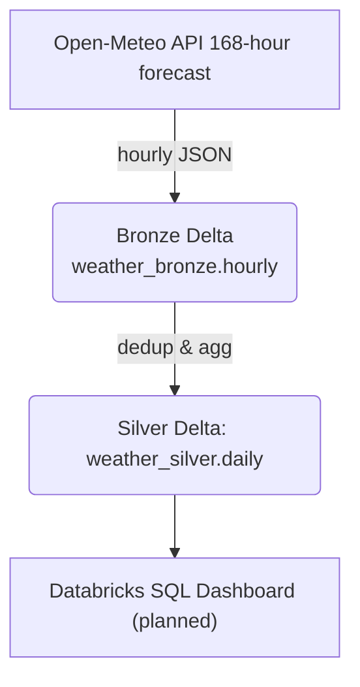

# Weather → Delta Lake Pipeline (Databricks CE)

> **A hands‑on demo pipeline** that ingests hourly weather forecasts, lands them in Delta Lake bronze, rolls up daily silver aggregates with data‑quality rules, and schedules everything on Databricks Free Edition (Serverless Jobs Compute).


---

## 📌 Project status

| Milestone                           | Delivered  | Key artefacts                                                              |
| ----------------------------------- | ---------- | -------------------------------------------------------------------------- |
| **1 · Bronze ingest (hourly)**      | ✅ Live     | `src/01_ingest_weather_bronze.ipynb` · `conf/job_weather_bronze.json`      |
| **2 · Silver daily + DQ**           | ✅ Live     | `src/02_transform_weather_silver.ipynb` · `conf/job_weather_pipeline.json` |
| **3 · CI / Alerts**                 | 🔄 Next    | GitHub Action, Slack webhook                                               |
| 4 · Perf tuning (OPTIMIZE / VACUUM) | 🔄 Planned | maintenance notebook                                                       |
| 5 · SQL dashboard (KPIs)            | 🔄 Planned | Databricks SQL artefacts                                                   |

## Tech stack (100 % free‑tier)

| Layer                | Tooling                                                 |
| -------------------- | ------------------------------------------------------- |
| Orchestration        | Databricks **Serverless Jobs Compute** (Free Edition)   |
| Processing           | PySpark 3.5 • Python 3.11                               |
| Storage              | Delta Lake — Bronze / Silver tables in `hive_metastore` |
| CI / CD              | GitHub Actions · Databricks CLI v0.258                  |
| Testing              | Pytest + Spark Connect (local)                          |
| Docs / Dev container | VS Code Dev Containers (`.devcontainer/`)               |

## Repo layout

```
weather-delta-lake/
├─ .devcontainer/              # VS Code cloud‑dev env
│   ├─ devcontainer.json
│   └─ Dockerfile
├─ assets/
│   └─ architecture.png        # pipeline diagram
├─ conf/
│   ├─ job_weather_bronze.json # single‑task ingest
│   └─ job_weather_pipeline.json  # bronze ➜ silver job
├─ src/
│   ├─ 01_ingest_weather_bronze.ipynb    # 168‑h forecast → bronze Delta
│   └─ 02_transform_weather_silver.ipynb # daily roll‑up + DQ → silver Delta
├─ tests/
│   └─ test_silver_transform.ipynb  # unit‑test ideas / fixtures
├─ LICENSE
├─ pyproject.toml
└─ README.md
```

## Pipeline flow



* **Bronze** — append‑only raw JSON; partition by `ingest_ts_date`.
* **Silver** — daily upsert (MERGE) keyed by `date + lat + lon`.

### Data‑quality rules

| Rule            | Check                           | Action           |
| --------------- | ------------------------------- | ---------------- |
| **Coverage**    | finished days must have 24 rows | fail task if not |
| **Temperature** | −60 ≤ avg °C ≤ 60               | flag row         |
| **Humidity**    | 0 ≤ min % ≤ 100                 | flag row         |

A `dq_passed` boolean rolls up all three rules; task raises an exception if any `false` rows exist.

## Quick‑start for reviewers

```bash
# 0 Prereqs: git · Python 3.11 · Databricks CLI >= 0.258

# 1 Clone & install dev deps
$ git clone https://github.com/<your-gh>/weather-delta-lake.git
$ cd weather-delta-lake
$ pip install -r requirements-dev.txt

# 2 Log in to your Databricks CE workspace
$ databricks auth login --host https://dbc-<hash>.cloud.databricks.com --token

# 3 Deploy the two‑task hourly pipeline
$ databricks jobs create --json @conf/job_weather_pipeline.json

# 4 Kick off first run & tail logs
$ databricks jobs run-now --job-id <id>
```

*(Free Edition automatically spins up Serverless compute; no cluster setup needed.)*

## Smoke‑test SQL (databricks SQL Editor)

```sql
-- Bronze sanity
SELECT ingest_ts_date, COUNT(*) AS rows
FROM   weather_bronze.hourly
GROUP  BY ingest_ts_date ORDER BY ingest_ts_date DESC;

-- Silver DQ
SELECT date, row_count, dq_passed
FROM   weather_silver.daily;
```


## License

[MIT](LICENSE) – free to fork, remix, learn.
