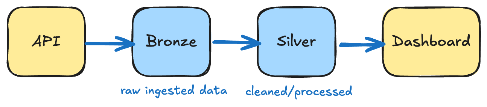
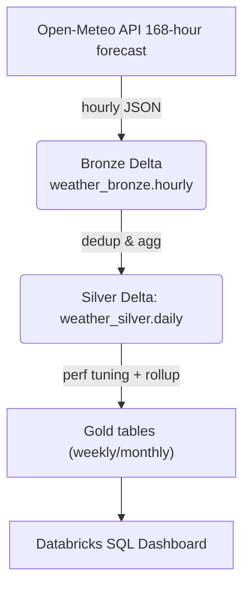
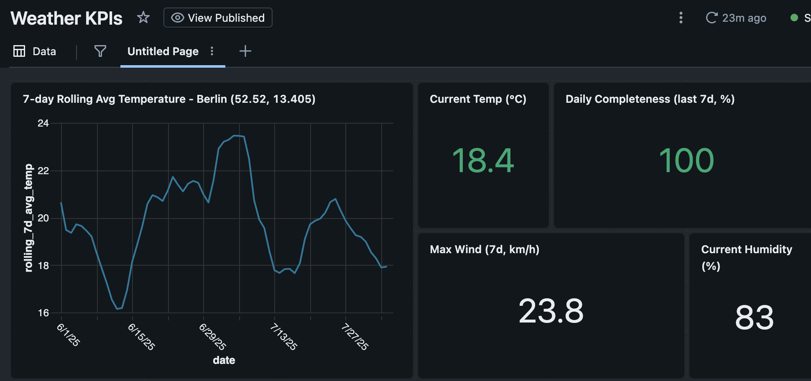

# Weather → Delta Lake Pipeline (Databricks CE)

> **A hands‑on demo pipeline** that ingests hourly weather forecasts, lands them in Delta Lake bronze, rolls up daily silver aggregates with data‑quality rules, and schedules everything on Databricks Free Edition (Serverless Jobs Compute).



---

## 📌 Project status

| Milestone                              | ✅ Status | Key Artefacts                                                                |
| -------------------------------------- | -------- | --------------------------------------------------------------------------- |
| **1 · Bronze ingest (hourly)**         | ✅ Done   | `src/01_ingest_weather_bronze.ipynb` · `conf/job_weather_bronze.json`       |
| **2 · Silver daily + DQ**              | ✅ Done   | `src/02_transform_weather_silver.ipynb` · `conf/job_weather_pipeline.json`  |
| **3 · CI / Alerts**                    | ✅ Done   | GitHub Actions, Slack webhook, DQ failure alerts via job + webhook          |
| **4 · Perf tuning (OPTIMIZE / VACUUM)**| ✅ Done   | `src/03_maintenance_gold_tables.ipynb`                                      |
| **5 · SQL Dashboard (KPIs)**           | ✅ Done   | Databricks SQL: 7-day avg temp trend, DQ stats, card KPIs                   |


## Tech stack (100 % free‑tier)

| Layer           | Tooling                                                          |
|----------------|------------------------------------------------------------------|
| Orchestration   | Databricks **Serverless Jobs Compute** (Free Edition)            |
| Processing      | PySpark 3.5 · Python 3.11                                        |
| Storage         | Delta Lake (bronze/silver tables on `hive_metastore`)            |
| CI / CD         | GitHub Actions · Databricks CLI v0.258                           |
| Testing         | Pytest · Spark Connect (local)                                   |
| Monitoring      | Email + Slack alerts if DQ fails or completeness <90%            |
| Docs / Dev Env  | `.devcontainer/` with VS Code + Python                          |

## Repo layout

```
weather-delta-lake/
├─ .devcontainer/              # VS Code cloud‑dev env
│   ├─ devcontainer.json
│   └─ Dockerfile
├─ assets/
│   └─ architecture.png        # pipeline diagram
├─ conf/
│   ├─ job_weather_bronze.json # single‑task ingest
│   └─ job_weather_pipeline.json  # bronze ➜ silver job
├─ src/
│   ├─ 01_ingest_weather_bronze.ipynb    # 168‑h forecast → bronze Delta
│   └─ 02_transform_weather_silver.ipynb # daily roll‑up + DQ → silver Delta
│   └─ 03_maintenance_gold_tables.ipynb # OPTIMIZE / VACUUM / rollups
├─ tests/
│   └─ test_silver_transform.ipynb  # unit‑test ideas / fixtures
├─ LICENSE
├─ pyproject.toml
└─ README.md
```

## Pipeline flow



* **Bronze** — append‑only raw JSON; partition by `ingest_ts_date`.
* **Silver** — daily upsert (MERGE) keyed by `date + lat + lon`.

### Data‑quality rules

| Rule         | Check                                      | Outcome                  |
|--------------|---------------------------------------------|---------------------------|
| Coverage     | 24 rows/day (unless it's the current date) | Fail task + log issue     |
| Temperature  | `-60 ≤ avg_temp_c ≤ 60`                    | Flag row (set `dq_passed` = false) |
| Humidity     | `0 ≤ min_humidity_pct ≤ 100`               | Flag row (set `dq_passed` = false) |
| DQ Summary   | `dq_passed` combines all rules             | Raise error if false rows |
| Alerting     | Completeness < 90% over 7 days             | Slack alert + fail job    |

A `dq_passed` boolean rolls up all three rules; task raises an exception if any `false` rows exist.

## Dashboard KPIs
Developed using **Databricks SQL Dashboard**, the following KPIs are visualized:

- **📈 7-Day Rolling Average Temperature**  
  Trend line showing smoothed daily average temperature for the last two months

- **🌡️ Current Temp (°C)**  
  Latest hourly temperature reading

- **✅ Daily Completeness (last 7d, %)**  
  Percentage of past 7 days with complete hourly data (24 readings/day)

- **💨 Max Wind Speed (7d, km/h)**  
  Highest recorded wind speed in the last 7 days

- **💧 Current Humidity (%)**  
  Latest hourly humidity reading

> **Location:** Berlin (52.52, 13.405)  
> **Dashboard Refresh:** Automatically updated via scheduled Databricks Jobs


## Quick‑start for reviewers

```bash
# 0. Prereqs: Python 3.11, Databricks CLI >= 0.258, GitHub auth setup

# 1. Clone & install
$ git clone https://github.com/<your-gh>/weather-delta-lake.git
$ cd weather-delta-lake
$ pip install -r requirements-dev.txt

# 2. Log into your Databricks CE workspace
$ databricks auth login --host https://dbc-<hash>.cloud.databricks.com --token

# 3. Deploy pipeline job
$ databricks jobs create --json @conf/job_weather_pipeline.json

# 4. Backfill historical data (optional)
# Manually run 01_ingest_weather_bronze.ipynb with start/end dates

# 5. Trigger the pipeline
$ databricks jobs run-now --job-id <ID>

```

*(Free Edition automatically spins up Serverless compute; no cluster setup needed.)*

## Smoke‑test SQL (databricks SQL Editor)

```sql
-- Bronze sanity
-- Check Bronze ingest
SELECT ingest_ts_date, COUNT(*) AS rows
FROM   weather_bronze.hourly
GROUP  BY ingest_ts_date ORDER BY ingest_ts_date DESC;

-- Validate Silver DQ
SELECT date, row_count, dq_passed
FROM   weather_silver.daily
ORDER  BY date DESC;

-- View alerts
SELECT * FROM weather_silver.alerts ORDER BY alert_ts DESC;
```

## License

[MIT](LICENSE) – free to fork, remix, learn.
